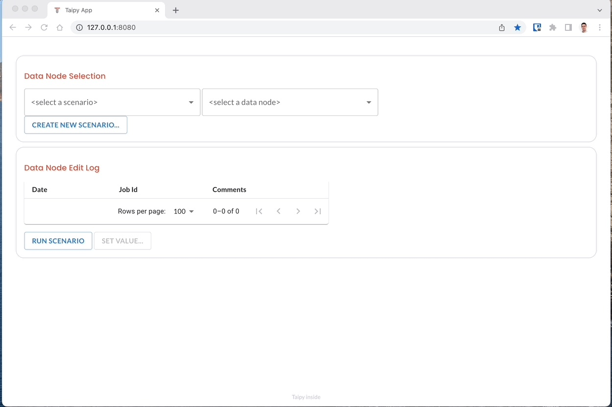
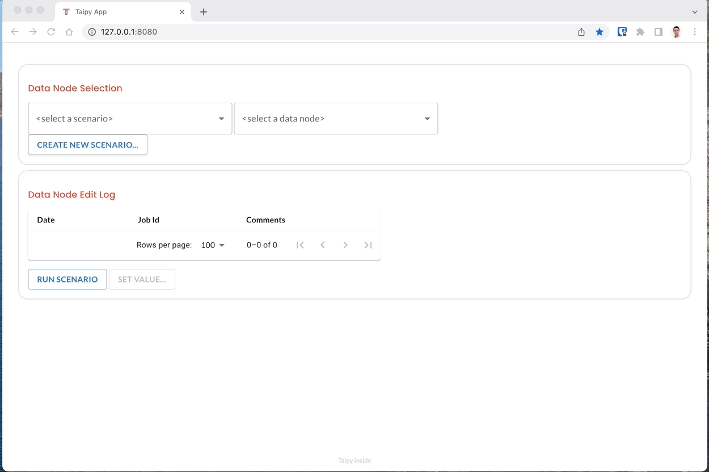
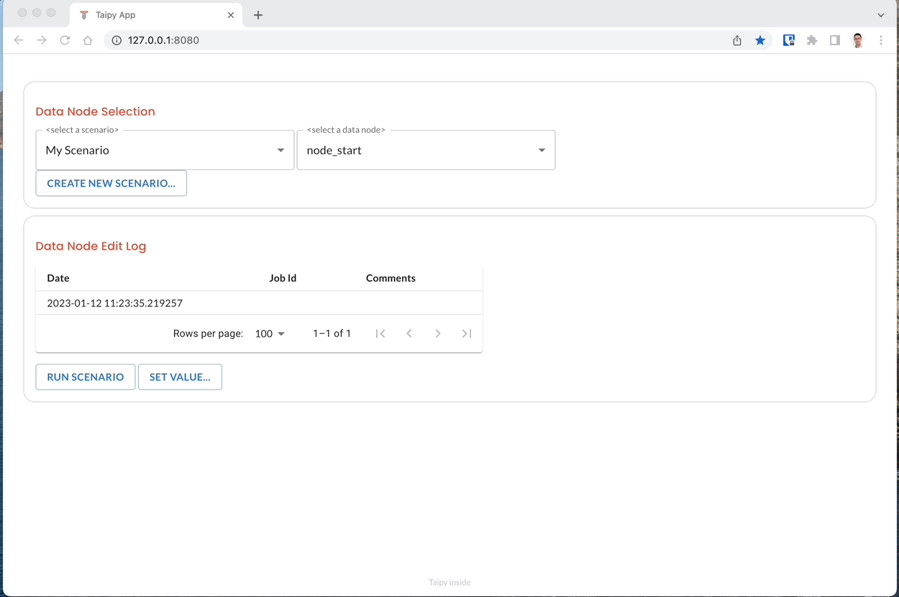
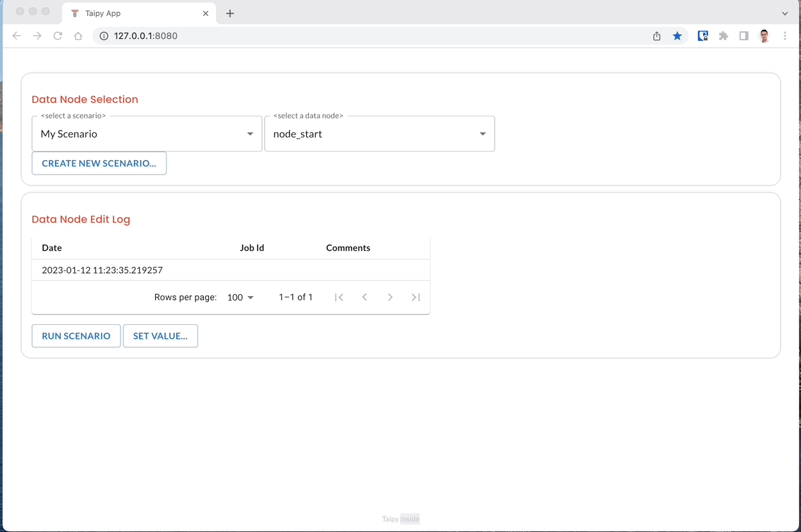
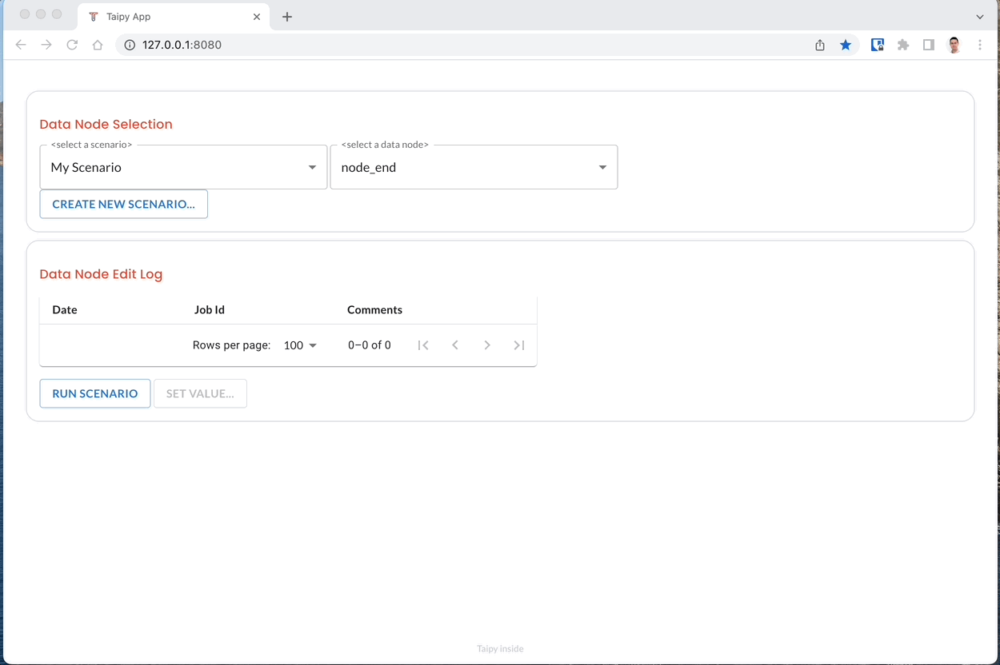

# Demo Edit Log

## What is the Demo Edit Log

This app is an example on how to build an Edit Log viewer for Taipy.

It demonstrates how you cna use the `edits` property of a Data Node to get the history of all the edits on this data node.

Please refer to the API documentation of DataNode for more details.

## Demo Type

- **Level**: Advanced
- **Topic**: Taipy-Core
- **Components/Controls**:
  - Taipy GUI: Selector, Dialog, Table

## Installation
Check out our [`INSTALLATION.md`](docs/INSTALLATION.md) file.

## Demo Overview

Run the app using `python main.py`.

It provides a simple configuration with
* A simple scenario config "My_super_scenario"
* A simple pipeline with
* Two data nodes: `node_start` and `node_end`
* A simple task that just takes data from `node_start`, displays a message and returns the data as `node_end`

When started for the first time, the app shows no data:

  

You can then create a new scenario by clicking the "Create Scenario" button:

  

Once created, you select the scenario from the first selector and the data node from the second selector:

  

When a data node is selected, the "Data Node Edit Log" section displays a live table of the edit log for this node. Notice that the node "start_node" already has an edit in its history. This is because Pickle Nodes are considered edited when they are created.

You can set a value to a node, as well as a optional comment. Notice that this operation would make sense only for Pickle data nodes...
Let's do it for the "start_node":

  

You can also run the scenario by clicking the "Run scenario" button:

  

## Contributing

Want to help build this demo? Check out our [`CONTRIBUTING.md`](CONTRIBUTING.md) file.

## License

Licensed under the Apache License, Version 2.0. See [`LICENSE.md`](LICENSE.md).
